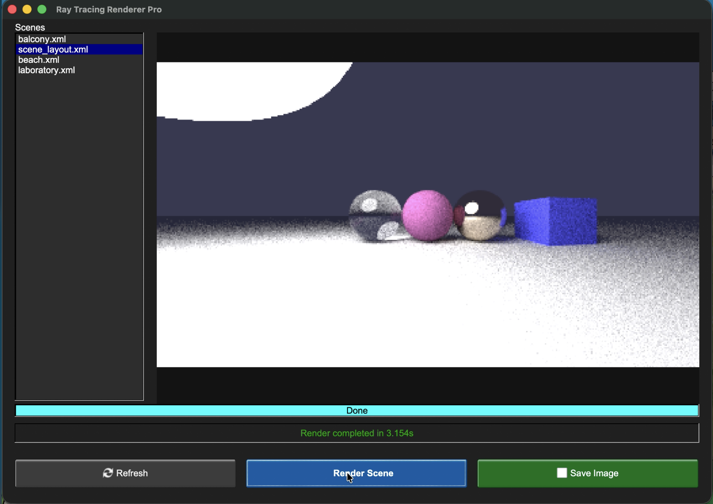

# Object-Oriented Ray Tracer

## 1. Project Analysis

### 1.1 Project Description
This project is a comprehensive C++ application designed to generate photorealistic images using **Path Tracing** techniques. It simulates the physical propagation of light in an environment—including reflection, refraction, and global illumination—to create high-quality 3D renderings.

The system is built upon a modular **Object-Oriented Programming (OOP)** architecture, ensuring extensibility and maintainability. It features a user-friendly **Graphical User Interface (GUI)** that allows users to select scene configurations, monitor rendering progress in real-time, and view results. To handle the high computational load, the engine utilizes multi-threading optimizations. Final renderings can be saved in high-quality **PNG** format.

### 1.2 Project File Structure
*   `src/`: Contains source code files (`.cpp`).
    *   `main.cpp`: Entry point and workflow control.
    *   `GUI.cpp`: Implementation of the graphical user interface using FLTK.
    *   `SceneXMLParser.cpp`: Implementation of XML parsing logic.
    *   `SavePng.cpp`: Implementation of PNG image encoding and saving logic.
*   `include/`: Contains header files (`.hpp`).
    *   `GUI.hpp`: Definitions for the application interface and state management.
    *   `Object.hpp`: Defines concrete geometric shapes (Sphere, Plane, Parallelepiped).
    *   `Material.hpp`: Defines material behaviors (Matte, Metal, Glass, Light).
    *   `Scene.hpp`: Scene container responsible for managing object lists.
    *   `Vec3.hpp`: Vector mathematics library.
    *   `SavePng.hpp`: Interface for image saving utilities.
    *   `SceneXMLParser.hpp`: Auxiliary interface definitions.
*   `scene/`: Contains XML scene configuration files (e.g., `scene_layout.xml`, `balcony.xml`, `beach.xml`, `laboratory.xml`).

### 1.3 Implemented Features
**Core Rendering Engine:**
*   **Path Tracing Algorithm:** Implements recursive ray tracing using Monte Carlo integration to solve anti-aliasing and soft shadow problems.
*   **Gamma Correction:** Applies Gamma 2.0 correction to ensure accurate color output.

**User Interaction & System:**
*   **XML Scene Parser:** Custom parser to load scene configurations, camera settings, and global settings from external XML files.
*   **Multi-threading Acceleration:** Implements a **Block-based Round-Robin** scheduling strategy to balance the load across CPU cores.
*   **Graphical User Interface (GUI):** A visual interface that allows users to browse available scenes, start/stop rendering, and view the progress visually.
*   **Image Output:** Supports saving results in **PNG** format for lossless quality, as well as the standard PPM format.

**Geometry Support:**
*   **Basic Primitives:** Spheres, Infinite Planes.
*   **Complex Shapes:** Parallelepipeds (Boxes), constructed by combining multiple quadrilaterals.
*   **Scene Management:** Uses the Composite Pattern to manage complex scenes containing multiple objects.

**Materials & Optics:**
*   **Matte (Lambertian):** Simulates rough diffuse surfaces.
*   **Metal:** Simulates specular reflection with adjustable fuzziness.
*   **Glass (Dielectric):** Simulates transparent media, implementing Snell's Law and the Fresnel effect (Schlick's approximation).
*   **Emissive Lights:** Supports volumetric area lights to illuminate the scene.

### 1.4 Usage of Object-Oriented Concepts
This project deeply applies OOP concepts to ensure modularity and maintainability:

*   **Polymorphism & Inheritance:**
    *   `SceneBaseObject`: Abstract base class for all geometries. It defines a unified `hit()` interface.
    *   `Material`: Abstract base class for surface properties. Virtual functions `scatter()` and `emit()` are overridden by concrete material classes.
*   **Encapsulation:**
    *   Classes like `AppState`, `Ray`, `Vec3`, and `HitRecord` encapsulate logic for the interface state, mathematical operations, and intersection data.
*   **Smart Pointers:**
    *   Extensive usage of `std::shared_ptr` within the scene graph (`Scene`) to automatically manage memory and prevent leaks.
*   **STL Containers:**
    *   Uses `std::vector` to manage object lists, pixel buffer data, and file lists.
*   **Exception Handling:**
    *   The XML parsing and file system modules use `try-catch` blocks to gracefully handle missing files or format errors.

---

## 2. Compilation & Execution

This project is built using **CMake** and requires **FLTK** (for GUI) and **libpng** (for image saving).

### 1. Windows

**Build:**
Run the following commands from the project root directory:
```bash
mkdir build 
cd build
cmake .. -DCMAKE_TOOLCHAIN_FILE=[path_to_vcpkg]/scripts/buildsystems/vcpkg.cmake
cmake --build . --config Release
```

**Run:** \
Ensure the *scene/* directory exists relative to the executable. Run the application to launch the GUI:
```bash
./Release/main
```

### 2. MacOS

**Pre-requisite: Install Dependencies**
Use Homebrew to install required build tools and libraries (install Homebrew first if not present):
```zsh
brew install cmake fltk libpng
```

**Build:**
Run the following commands from the project root directory:
```zsh
mkdir build 
cd build
cmake ..
make
```

**Run:** \
Ensure the *scene/* directory exists relative to the executable. Run the application to launch the GUI:
```zsh
./main
```

### 3. Linux

**Build:**
Run the following commands from the project root directory:
```zsh
mkdir build 
cd build
cmake ..
make
```

**Run:** \
Ensure the *scene/* directory exists relative to the executable. Run the application to launch the GUI:
```zsh
./main
```

## 3. Usage

The application window will open, displaying a list of available scenes found in the scene/ directory.

Select a scene from the list (e.g., balcony.xml) and click Render. The rendering progress will be displayed in real-time.

Upon completion, click the Save Image button to save the result as a PNG image.

